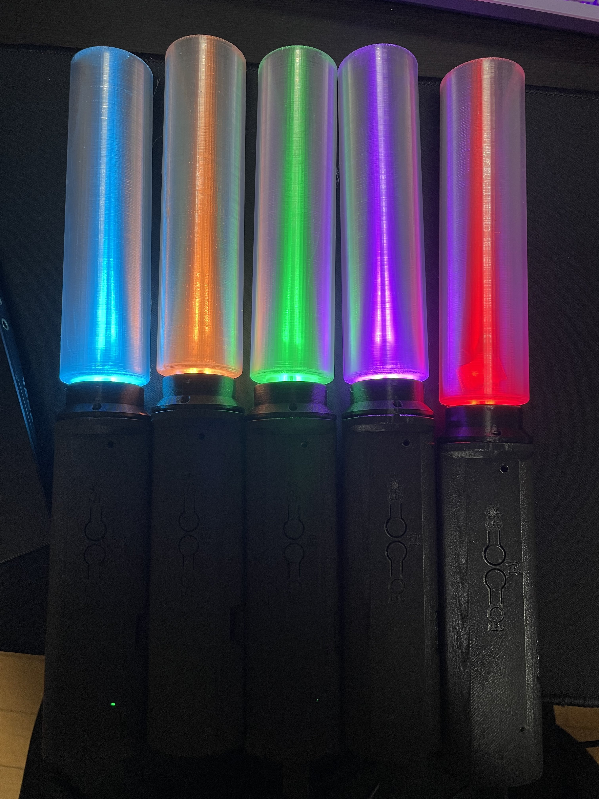
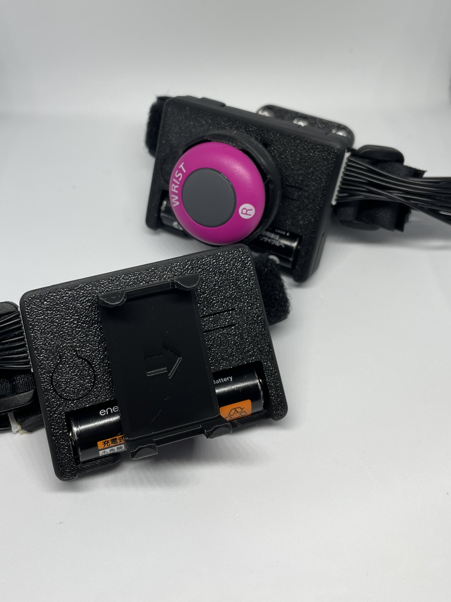
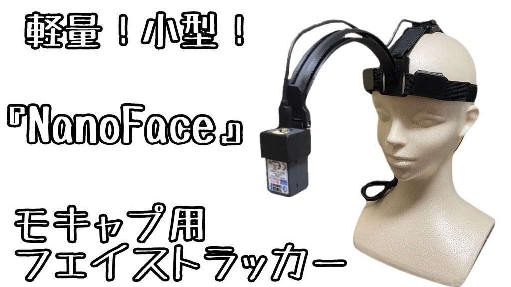

# 霧雨工房 公式ホームページ

霧雨工房はVTuber活動やアバター生活を応援する各種アイテムやアプリの開発・頒布をしています。

## 製品

BOOTHショップ「霧雨工房」もご覧ください。多数のアイテムを取り扱っています。

[https://kirisamenanoha.booth.pm/](https://kirisamenanoha.booth.pm/)

### 振って応援ペンライト めっせんじゃぁ（開発中）

「振って応援ペンライト めっせんじゃぁ」はライブ配信で推しを応援する、VTuber/YouTuberファンに向けた特別なペンライトです。まさに現実のライブでペンライトを振るように、YouTubeライブ配信でもペンライトを振って推しをチャットで応援できます。

現在開発中です。Twitter (X)にて最新情報をチェックしてね！

### IllumiTrack 無線ハンドトラッキングデバイス

IllumiTrackは手・指のモーショントラッキングデバイスです。市販されている同種のデバイスとは異なるセンサー・方式を採用し、お手ごろな価格を実現しました。

専用アプリ「Mocap Assistant Plus」では、IllumiTrackも含めた全身のトラッキングをアプリひとつで実現します。

ご注意： IllumiTrackはVTuber活動などモーショントラッキング向けのデバイスです。VRChatなどVR SNSでの利用には向いていません。

[https://kirisamenanoha.booth.pm/items/6493085](https://kirisamenanoha.booth.pm/items/6493085)

### NanoFace フェイストラッカー(無線WEBカメラ)

NanoFaceは、顔の正面に固定して設置できるフェイストラッキング用無線Webカメラです。スマホよりも軽量に、デスクに固定するWebカメラよりも確実なトラッキングを実現します。

専用アプリ「NanoFace」や「Mocap Assistant Plus」とセットで利用します。

[https://kirisamenanoha.booth.pm/items/6135475](https://kirisamenanoha.booth.pm/items/6135475)

### 問い合わせ先

- BOOTH: [BOOTH 霧雨工房](https://kirisamenanoha.booth.pm/) ※購入したアカウントからメッセージをお送りください。
- Twitter (X): [霧雨工房 公式アカウント](https://x.com/KirisameKOBO)

## 利用規約・プライバシーポリシー

### 「振って応援ペンライト めっせんじゃぁ」利用規約

「振って応援ペンライト めっせんじゃぁ」利用規約

最終更新日：2025年8月23日

本利用規約（以下「本規約」といいます。）は、霧雨工房（以下「当サークル」といいます。）が提供するアプリケーション「振って応援ペンライト」（関連するハードウェアデバイスを含む。以下「本システム」といいます。）の利用条件を定めるものです。本システムをご利用になるユーザー（以下「ユーザー」といいます。）は、本規約に同意の上、本システムを利用するものとします。

第1条（定義） \
本規約において使用する用語の定義は、以下のとおりとします。 \
1. 「本システム」とは、当サークルが提供する専用ハードウェアデバイスおよび専用ソフトウェアアプリケーション「振って応援ペンライト」を通じて提供される一切のサービスをいいます。
2. 「本デバイス」とは、本システムの利用に必要となる、当サークルが提供する専用のペンライト型ハードウェアデバイスをいいます。
3. 「本アプリ」とは、本システムの利用に必要となる、当サークルが提供する専用のソフトウェアアプリケーションをいいます。
4. 「ユーザー」とは、本規約に同意し、本システムを利用する個人をいいます。

第2条（規約への同意）
1. ユーザーは、本規約に同意しなければ本システムを利用することはできません。ユーザーは、本アプリをインストールまたは利用開始することによって、本規約に有効かつ取消不能な同意をしたものとみなされます。
2. 本システムはYouTube APIサービスを利用しています。ユーザーは、本規約に加えて、YouTube利用規約（https://www.youtube.com/t/terms）にも同意する必要があります。

第3条（サービスの利用条件）
1. 本システムの利用には、本デバイスおよび本アプリの両方が必要です。
2. 本システムの対象年齢は16歳以上です。
3. 本システムは、日本国内のユーザーのみを対象とします。

第4条（知的財産権） \
本システムに関する著作権、特許権、商標権その他一切の知的財産権は、すべて当サークルまたは当サークルにライセンスを許諾している者に帰属します。本規約に基づく本システムの利用許諾は、これらの知的財産権の使用許諾を意味するものではありません。

第5条（禁止事項） \
ユーザーは、本システムの利用にあたり、以下の行為をしてはなりません。
1. 法令、裁判所の判決、決定もしくは命令、または法令上拘束力のある行政措置に違反する行為。
2. 公の秩序または善良の風俗を害するおそれのある行為。
3. 当サークルまたは第三者の知的財産権、プライバシー権、名誉権、信用その他法律上または契約上の権利を侵害する行為。
4. 本システムのサーバーやネットワークシステムに支障を与える行為、BOT、チートツール、その他の技術的手段を利用してサービスを不正に操作する行為。
5. 本システムのリバースエンジニアリング、逆コンパイル、逆アセンブルその他これらに類する行為。
6. YouTubeの利用規約またはコミュニティガイドラインに違反する行為、またはその助長となる行為。
7. スパム行為とみなされる、またはそのおそれのある態様でチャットを送信する行為。
8. その他、当サークルが不適切と判断する行為。

第6条（注意事項）
1. 本システムは、YouTube APIサービスの利用上限（Quota）の範囲内で提供されます。ユーザーによる短時間の連続利用などにより、API利用上限に達した場合、予告なく本システムを通じたチャット送信機能が一時的に利用できなくなることがあります。
2. ユーザーが設定したチャットテキストの内容や送信頻度によっては、YouTubeのシステムによりスパム行為とみなされ、ユーザーのYouTubeアカウントが制限される等の不利益を被る可能性があります。ユーザーは、自身の責任においてチャットテキストを設定し、送信するものとします。
3. 当サークルは、前2項に起因してユーザーに生じた損害について、一切の責任を負いません。

第7条（免責事項）
1. 当サークルは、本システムがユーザーの特定の目的に適合すること、期待する機能・商品的価値・正確性・有用性を有すること、および不具合が生じないことについて、何ら保証するものではありません。
2. 当サークルは、本システムの利用に起因してユーザーに生じたあらゆる損害について一切の責任を負いません。ただし、当サークルの故意または重過失による場合はこの限りではありません。

第8条（本システムの変更、中断、終了）
1. 当サークルは、当サークルの都合により、本システムの内容を変更し、または提供を終了することができます。
2. 本アプリは、起動時にアップデートの有無を確認し、新しいバージョンが利用可能な場合はユーザーに通知することがあります。安定したサービス利用のため、最新のバージョンにアップデートすることを推奨します。
3. 当サークルは、本条に基づき当サークルが行った措置に基づきユーザーに生じた損害について一切の責任を負いません。

第9条（規約の変更） \
当サークルは、必要と判断した場合には、ユーザーに通知することなくいつでも本規約を変更することができます。変更後の本規約は、本アプリ内または当サークルが運営するウェブサイト内に掲示された時点からその効力を生じるものとし、ユーザーが変更後に本システムを利用した場合には、変更後の規約に同意したものとみなします。

第10条（準拠法および管轄裁判所） \
本規約の準拠法は日本法とします。本規約に起因し、または関連する一切の紛争については、福島地方裁判所 郡山支部を第一審の専属的合意管轄裁判所とします。

以上

### 「振って応援ペンライト めっせんじゃぁ」プライバシーポリシー

「振って応援ペンライト めっせんじゃぁ」プライバシーポリシー

最終更新日：2025年8月23日

霧雨工房（以下「当サークル」といいます。）は、当サークルが提供するアプリケーション「振って応援ペンライト」（以下「本システム」といいます。）における、ユーザーの個人情報の取扱いについて、以下のとおりプライバシーポリシー（以下「本ポリシー」といいます。）を定めます。

第1条（総則） \
当サークルは、ユーザーのプライバシーを尊重し、ユーザー情報の保護を重要な責務であると考えております。本ポリシーは、本システムの利用に関し、当サークルが取得するユーザー情報の取扱いを定めるものです。

第2条（YouTube APIサービスの利用） \
本システムは、その機能を実現するためにYouTube APIサービスを利用しています。したがって、ユーザーは本ポリシーに加えて、Google社のプライバシーポリシーが適用されることに同意するものとします。
Googleプライバシーポリシー: http://www.google.com/policies/privacy

第3条（取得する情報および利用目的） \
当サークルは、本システムの提供にあたり、以下の情報を取得し、それぞれの目的の範囲内で利用します。

1. **ハードウェアデバイスから取得する情報**
   - **情報の内容:** 本システム専用ハードウェアデバイスに内蔵された加速度センサーの情報。
   - **利用目的:** 本システムの核となる機能（ペンライトを振る動作を検知し、チャット送信のトリガーとするため）を提供するため。

2. **YouTubeから取得する情報**
   - **情報の内容:** 
     a) YouTubeアカウントの認証情報（APIトークン）
     b) YouTubeアカウントのプロフィール情報（チャンネル名、プロフィール画像）
   - **利用目的:** 
     a) ユーザーがログイン状態を維持し、本システムからYouTubeへチャットを送信する機能を継続的に利用するため。認証情報はユーザーのPC内の本アプリ用フォルダに、暗号化した上でファイルとして安全に保存されます。
     b) 本アプリ内で、ユーザーがどのアカウントでログインしているかを識別し表示するため。プロフィール情報は本アプリ内に保存されません。

3. **本システムの利用状況に関する情報**
   - **情報の内容:** 本システムの品質向上および利用状況の分析のため、Google社の提供するGoogle Analyticsを利用し、匿名化された利用情報を収集することがあります。これには、アプリのバージョン、イベントの発生（例：アプリの起動、チャットの送信等）などが含まれますが、ユーザーを直接特定する個人情報は一切含まれません。
   - **利用目的:** サービスの改善、不具合の修正、および今後の開発の参考とするため。

4. **収集しない情報**
   本システムは、ユーザーの氏名、住所、電話番号、メールアドレス、Googleパスワード等、上記に定めのない個人を直接特定する情報を収集・保存することはありません。

第4条（情報の第三者提供） \
当サークルは、法令に基づく場合を除き、ユーザーの同意なく取得した情報を第三者に提供することはありません。

第5条（情報の管理と保護） \
当サークルは、取得した情報の紛失、破壊、改ざん、および漏洩などを防止するため、不正アクセス対策等の適切な安全管理措置を講じます。具体的には、YouTube APIとの通信はSSL/TLSにより暗号化し、ユーザーのPC内に保存する認証情報はOSの機能を用いて暗号化します。

第6条（アクセス許可の取り消し） \
ユーザーは、Googleのセキュリティ設定ページから、いつでも本システムへのAPIアクセス許可を取り消すことができます。アクセス許可を取り消すと、本システムは利用できなくなります。
Googleセキュリティ設定ページ: https://security.google.com/settings/security/permissions

第7条（ユーザーによる情報の削除） \
ユーザーは、本アプリ内の機能を利用して、本アプリに保存されたYouTubeアカウントの認証情報をいつでも削除することができます。認証情報を削除した場合、本システムを利用するには再度YouTubeへのログインが必要となります。

第8条（問い合わせ窓口） \
本ポリシーに関するご意見、ご質問、その他ユーザー情報の取扱いに関するお問い合わせは、下記の窓口までお願いいたします。 \
連絡先：（霧雨工房 代表） 霧雨なのは  kirisame.tech@gmail.com 

第9条（プライバシーポリシーの変更） \
当サークルは、法令その他本ポリシーに別段の定めのある事項を除いて、ユーザーに通知することなく、本ポリシーを変更することができるものとします。変更後のプライバシーポリシーは、本アプリ内または当サークルが運営するウェブサイト内に掲示された時点からその効力を生じるものとします。

以上
