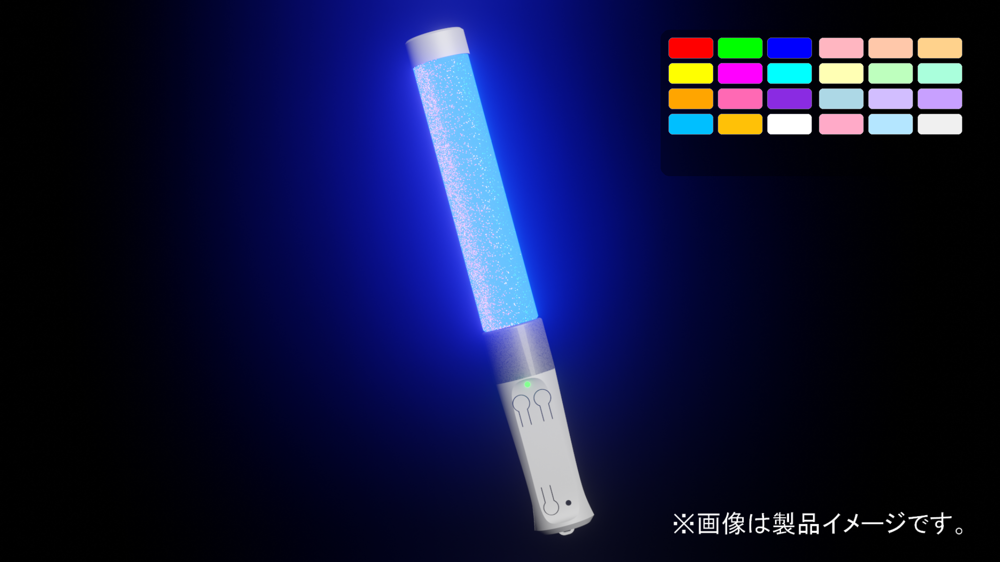

# 霧雨工房 公式ホームページ

霧雨工房は、VTuber活動やアバター生活を応援する各種アイテムやアプリの開発・頒布をしています。

BOOTHショップ「霧雨工房」もご覧ください。多数のアイテムを取り扱っています。  

[https://kirisamenanoha.booth.pm/](https://kirisamenanoha.booth.pm/)

---

# 振って応援ペンライト めっせんじゃぁ について

# 各種ポリシー
ご利用前に必ずお読みください。

- 利用規約 [https://kirisamekobo.com/terms](https://kirisamekobo.com/terms)
- プライバシーポリシー [https://kirisamekobo.com/privacy](https://kirisamekobo.com/privacy)

「振って応援ペンライト」「振って応援ペンライト めっせんじゃぁ」は、ライブ配信で推しを応援したい VTuber / YouTuber ファンに向けた、専用ハードウェア連携システムです。  
現実のライブ会場でペンライトを振るように、YouTube ライブ配信でも、専用ペンライトを振る操作によって応援用チャットを送信できます。

本システムは、専用のペンライト型ハードウェアと Windows 向け専用アプリで構成されています。  
アプリ単体ではチャット送信は行われず、ユーザーが実際にペンライトを振ったときのみ、事前に設定したチャットメッセージが送信されます。

## YouTube API / OAuth 認証を使用する理由

「振って応援ペンライト めっせんじゃぁ」では、以下の目的のために YouTube API および Google / YouTube の OAuth 認証を使用します。

- ユーザー本人が YouTube アカウントでログインするため
- 視聴対象の YouTube ライブ配信情報を取得するため
- YouTube ライブチャットへメッセージを送信するため

本アプリは、ライブ視聴者が専用ペンライトを振るという**明示的な操作**をきっかけとして、PC アプリから YouTube ライブチャットへメッセージを送信します。  
ユーザーの明示的な操作なしに、自動でチャットを投稿することはありません。

## データの取り扱いについて

本アプリでは、YouTube API を通じてログイン、ライブ配信情報の取得、チャット送信を行います。  
取得した情報のうち、**ログイン情報を除き、ライブ配信情報やその他の取得データはアプリ内に保存しません。**  
また、Google アカウントのパスワードを収集・保存することはありません。

保存されたログイン情報は、アプリ内からいつでも削除できます。  
取得した情報や、ユーザーが設定したチャットテキストを、YouTube 以外の第三者へ共有することはありません。

## 安全対策

本システムでは、不適切な利用を防ぐために以下の仕組みを設けています。

- チャット送信は、専用ペンライトの振り操作があった場合のみ実行されます
- 送信内容は、ユーザーが事前に設定したテキストのみです
- 不適切な文言を防ぐためのブロックリストを設けています
- チャット送信には時間当たりの遅延制限があります

## 対象ユーザー

- 日本国内のユーザー向け
- 対象年齢 16 歳以上

---

# 製品

## IllumiTrack 無線ハンドトラッキングデバイス

IllumiTrackは手・指のモーショントラッキングデバイスです。市販されている同種のデバイスとは異なるセンサー・方式を採用し、お手ごろな価格を実現しました。

専用アプリ「Mocap Assistant Plus」では、IllumiTrackも含めた全身のトラッキングをアプリひとつで実現します。

ご注意：IllumiTrackはVTuber活動などモーショントラッキング向けのデバイスです。VRChatなどVR SNSでの利用には向いていません。

[https://kirisamenanoha.booth.pm/items/6493085](https://kirisamenanoha.booth.pm/items/6493085)

## NanoFace フェイストラッカー（無線WEBカメラ）

NanoFaceは、顔の正面に固定して設置できるフェイストラッキング用無線Webカメラです。スマホよりも軽量に、デスクに固定するWebカメラよりも確実なトラッキングを実現します。

専用アプリ「NanoFace」や「Mocap Assistant Plus」とセットで利用します。

[https://kirisamenanoha.booth.pm/items/6135475](https://kirisamenanoha.booth.pm/items/6135475)

---

# お問い合わせ先

- BOOTH: [BOOTH 霧雨工房](https://kirisamenanoha.booth.pm/) ※購入したアカウントからメッセージをお送りください
- Twitter (X): [霧雨工房 公式アカウント](https://x.com/KirisameKOBO)
- Mail代表者氏名 二瓶真也:kirisame.tech@gmail.com
- 適格請求書発行事業者 登録番号 T2810874854205
---

